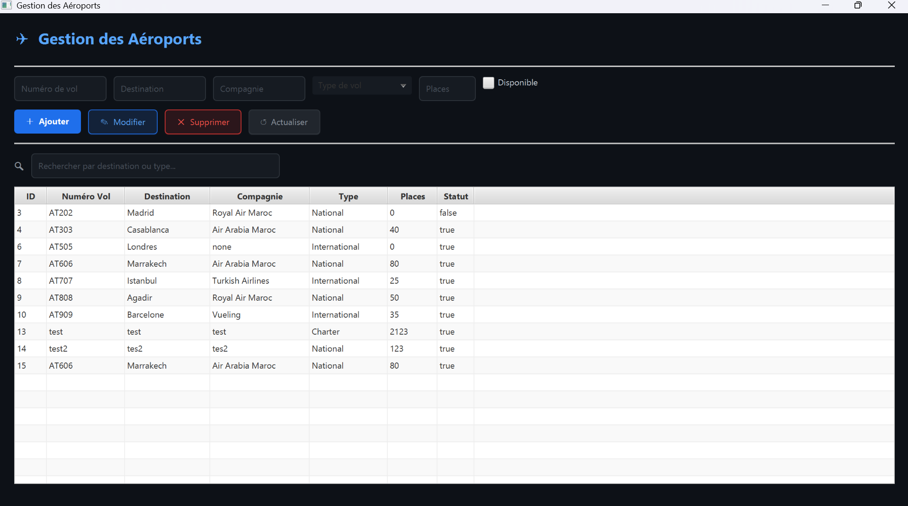

# Airport Flight Management System

## Overview

Airport Flight Management System is a Java desktop application for managing airport flights through a clean JavaFX interface. The application allows users to add, edit, delete, list, and search flights while storing data persistently in a MySQL database through Hibernate ORM.

The project was developed as an academic Java application and follows an MVC-oriented structure that separates the entity model, persistence layer, service logic, and graphical interface.

## Preview



## Features

- Add new flights with flight number, destination, airline company, type, available seats, and status.
- Update existing flight information.
- Delete selected flights.
- Display all flights in a JavaFX `TableView`.
- Search flights in real time by destination or flight type.
- Persist flight data using MySQL and Hibernate.
- Use a dark-themed JavaFX interface.

## Technologies Used

- Java
- JavaFX
- Hibernate ORM
- MySQL
- JPA annotations
- NetBeans / Maven-compatible structure

## Architecture

The project follows an MVC-inspired architecture:

```text
airport-flight-management-system/
├── src/
│   ├── entities/          # JPA entity classes
│   ├── service/           # CRUD and business logic
│   ├── util/              # Hibernate configuration utility
│   ├── vue/               # JavaFX FXML view and controller
│   ├── main/              # Application entry point
│   └── hibernate.cfg.xml
├── database/              # SQL schema and sample data
├── docs/                  # Technical documentation
├── screenshots/           # Application screenshots
├── nbproject/             # NetBeans project files
├── build.xml              # Ant/NetBeans build file
├── pom.xml                # Optional Maven build file
└── README.md
```

## Database Setup

Create the database and table using:

```sql
CREATE DATABASE IF NOT EXISTS gestion_aeropuertos;
USE gestion_aeropuertos;

CREATE TABLE IF NOT EXISTS vol (
    id INT PRIMARY KEY AUTO_INCREMENT,
    numero_vol VARCHAR(20) NOT NULL,
    destination VARCHAR(100) NOT NULL,
    compagnie VARCHAR(100) NOT NULL,
    type_vol VARCHAR(50) NOT NULL,
    places_disponibles INT NOT NULL,
    statut BOOLEAN NOT NULL
);
```

You can also run the scripts located in:

```text
database/schema.sql
database/sample_data.sql
```

## Configuration

Before running the application, update the MySQL credentials in:

```text
src/hibernate.cfg.xml
```

Example:

```xml
<property name="hibernate.connection.username">root</property>
<property name="hibernate.connection.password">your_password</property>
```

## Running the Project

### Option 1: NetBeans

1. Open the project in NetBeans.
2. Configure the required libraries if needed:
   - Hibernate
   - MySQL Connector/J
   - JavaFX
3. Create the MySQL database using `database/schema.sql`.
4. Update `src/hibernate.cfg.xml`.
5. Run the project from the `main.Main` class.

### Option 2: Maven

If Maven is available, run:

```bash
mvn clean javafx:run
```

## Main Classes

| Class | Role |
|---|---|
| `Vol` | JPA entity mapped to the `vol` table |
| `HibernateUtil` | Initializes the Hibernate `SessionFactory` |
| `VolService` | Handles CRUD operations and search |
| `VueController` | Connects the JavaFX interface to the service layer |
| `VueFX` | Loads the FXML view and starts the JavaFX window |
| `Main` | Application entry point |

## Future Improvements

- Add form validation and user-friendly error messages.
- Replace boolean status display with readable labels such as `Available` / `Unavailable`.
- Add authentication for administrators.
- Add reporting and export features.
- Add unit tests for the service layer.
- Improve dependency management using Maven only.

## Author

Anwar Nafidi  
Big Data Engineering Student  
ENSA Berrechid, Morocco
